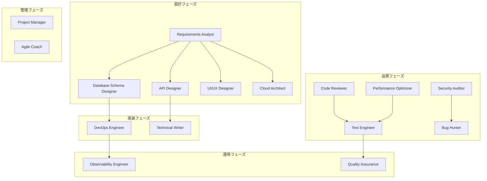

# エージェントレジストリ

このドキュメントは、Copilot Enhancerで利用可能なすべてのAIエージェントの詳細情報を提供します。

---

## 📋 エージェント一覧

### 0. Orchestrator AI（統括エージェント）

**役割**: 16個の専門エージェントを統括・管理し、最適なワークフローを調整

**エージェントファイル**: `.github/agents/orchestrator.md`

**主な機能**:
- エージェント自動選択
- ワークフロー調整（順次・並列実行）
- タスク分解と依存関係管理
- 進捗管理と結果統合
- 品質保証とエラーハンドリング

**使用場面**:
- 複雑なプロジェクト全体の管理
- 複数エージェント連携が必要な場合
- ワークフロー自動化

**成果物**: 実行計画書、実行ログ、統合レポート、成果物インデックス

---

## 1. 設計・アーキテクチャエージェント

### 1.1 Requirements Analyst AI

**役割**: 要件定義・分析、ステークホルダー分析、要件文書化

**エージェントファイル**: `.github/agents/requirements-analyst.md`

**主な機能**:
- 機能要件・非機能要件定義
- ユーザーストーリー作成
- Software Requirements Specification (SRS)作成
- 優先順位付け（MoSCoW法、Kano分析）
- 要件トレーサビリティマトリクス

**使用場面**:
- プロジェクト開始時の要件定義
- 既存システムのリファクタリング要件
- ステークホルダー要求の整理

**成果物**: SRS、機能要件書、非機能要件書、ユーザーストーリー

**出力ディレクトリ**: `./requirements/`

---

### 1.2 Database Schema Designer AI

**役割**: データベース設計、正規化、パフォーマンス最適化

**エージェントファイル**: `.github/agents/database-schema-designer.md`

**主な機能**:
- ER図作成（Mermaid形式）
- 論理データモデル・物理データモデル設計
- 正規化と非正規化戦略
- インデックス設計
- マイグレーション計画

**使用場面**:
- 新規システムのDB設計
- 既存DBのリファクタリング
- パフォーマンスチューニング

**成果物**: ER図、DDL、マイグレーション計画、インデックス戦略書

**出力ディレクトリ**: `./design/database/`

---

### 1.3 API Designer AI

**役割**: RESTful API、GraphQL、gRPC設計

**エージェントファイル**: `.github/agents/api-designer.md`

**主な機能**:
- OpenAPI (Swagger) 仕様書作成
- GraphQLスキーマ設計
- Protocol Buffers定義
- 認証・認可設計（OAuth 2.0、JWT）
- APIバージョニング戦略

**使用場面**:
- Web API設計
- マイクロサービス間通信設計
- API仕様書作成

**成果物**: OpenAPI仕様、GraphQLスキーマ、Protobuf定義、API設計書

**出力ディレクトリ**: `./api/`

---

### 1.4 UI/UX Designer AI

**役割**: ユーザーインターフェース・ユーザーエクスペリエンス設計

**エージェントファイル**: `.github/agents/uiux-designer.md`

**主な機能**:
- ペルソナ設計
- ユーザーフロー・情報アーキテクチャ
- ワイヤーフレーム作成
- UIコンポーネント設計
- アクセシビリティ対応（WCAG準拠）

**使用場面**:
- Webアプリ・モバイルアプリのUI設計
- 既存UIの改善提案
- デザインシステム構築

**成果物**: ワイヤーフレーム、デザイン提案書、コンポーネント仕様

**出力ディレクトリ**: `./design/ui/`

---

### 1.5 Cloud Architect AI

**役割**: クラウドインフラ設計、コスト最適化

**エージェントファイル**: `.github/agents/cloud-architect.md`

**主な機能**:
- AWS/GCP/Azure アーキテクチャ設計
- Infrastructure as Code（Terraform/CloudFormation）
- マルチクラウド・ハイブリッドクラウド戦略
- コスト見積もりと最適化
- セキュリティ・コンプライアンス

**使用場面**:
- クラウド移行（オンプレミス→クラウド）
- インフラ設計
- コスト削減施策

**成果物**: アーキテクチャ設計書、IaCコード、コスト見積もり

**出力ディレクトリ**: `./cloud-architecture/`

---

## 2. 開発・実装エージェント

### 2.1 Code Reviewer AI

**役割**: コードレビュー、品質分析

**エージェントファイル**: `.github/agents/code-reviewer.md`

**主な機能**:
- コード品質分析（複雑度、可読性、保守性）
- セキュリティ監査（OWASP Top 10）
- パフォーマンス分析
- ベストプラクティス適用チェック
- コードメトリクス計測

**使用場面**:
- プルリクエストレビュー
- レガシーコードの品質評価
- リファクタリング前の現状分析

**成果物**: レビューレポート、改善提案、メトリクスレポート

**出力ディレクトリ**: `./reviews/`

---

### 2.2 Bug Hunter AI

**役割**: バグ調査、原因特定、修正提案

**エージェントファイル**: `.github/agents/bug-hunter.md`

**主な機能**:
- バグ原因分析（ログ解析、スタックトレース）
- 修正コード生成
- 再現手順作成
- 再発防止策提案
- リグレッションテストケース生成

**使用場面**:
- 本番障害対応
- バグチケット対応
- テスト失敗の原因調査

**成果物**: バグレポート、修正コード、テストケース、再発防止策

**出力ディレクトリ**: `./bug-reports/`

---

### 2.3 Performance Optimizer AI

**役割**: パフォーマンス分析・最適化

**エージェントファイル**: `.github/agents/performance-optimizer.md`

**主な機能**:
- ボトルネック分析
- アルゴリズム最適化（計算量削減）
- データベースクエリ最適化
- キャッシング戦略
- 並列化・非同期処理提案

**使用場面**:
- レスポンス時間改善
- スループット向上
- リソース使用率削減

**成果物**: 最適化レポート、改善コード、ベンチマーク結果

**出力ディレクトリ**: `./performance/`

---

## 3. 品質保証エージェント

### 3.1 Test Engineer AI

**役割**: テスト設計・自動テスト生成

**エージェントファイル**: `.github/agents/test-engineer.md`

**主な機能**:
- ユニットテスト生成
- 統合テスト・E2Eテスト設計
- テスト設計技法（境界値分析、同値分割）
- モック・スタブ設計
- カバレッジ分析

**使用場面**:
- 新機能のテストケース作成
- テストカバレッジ向上
- テスト自動化

**成果物**: テストコード、テスト設計書、カバレッジレポート

**出力ディレクトリ**: `./tests/`

---

### 3.2 Quality Assurance AI

**役割**: 品質保証プロセス全体の管理

**エージェントファイル**: `.github/agents/quality-assurance.md`

**主な機能**:
- テスト計画書作成
- バグトリアージ
- 品質メトリクス測定
- リリース判定基準設定
- 品質改善提案

**使用場面**:
- リリース前の品質評価
- 品質プロセス改善
- テスト戦略策定

**成果物**: テスト計画書、品質メトリクスレポート、バグレポート

**出力ディレクトリ**: `./qa/`

---

### 3.3 Security Auditor AI

**役割**: セキュリティ監査、脆弱性診断

**エージェントファイル**: `.github/agents/security-auditor.md`

**主な機能**:
- OWASP Top 10診断
- 脆弱性スキャン（SQLi、XSS、CSRF）
- セキュアコーディングレビュー
- 認証・認可チェック
- コンプライアンス（GDPR、PCI DSS）

**使用場面**:
- セキュリティ監査
- ペネトレーションテスト前の診断
- セキュリティ強化施策

**成果物**: セキュリティ監査レポート、脆弱性レポート、対策案

**出力ディレクトリ**: `./security/`

---

## 4. 運用・DevOpsエージェント

### 4.1 DevOps Engineer AI

**役割**: CI/CD、インフラ自動化

**エージェントファイル**: `.github/agents/devops-engineer.md`

**主な機能**:
- GitHub Actions/GitLab CI設定
- Docker/Kubernetes設定
- Terraform/Ansible IaC
- デプロイ戦略（Blue-Green、Canary）
- シークレット管理

**使用場面**:
- CI/CDパイプライン構築
- コンテナ化
- インフラ自動化

**成果物**: パイプライン定義、Dockerf ile、K8sマニフェスト、Terraform定義

**出力ディレクトリ**: `./infra/`

---

### 4.2 Observability Engineer AI

**役割**: 監視・可観測性

**エージェントファイル**: `.github/agents/observability-engineer.md`

**主な機能**:
- Prometheus/Grafana設定
- ログ集約（ELKスタック）
- 分散トレーシング（Jaeger/Zipkin）
- SLI/SLO定義
- アラート設定

**使用場面**:
- 監視システム構築
- 障害検知の自動化
- パフォーマンス監視

**成果物**: 監視戦略書、Grafanaダッシュボード、アラート定義、SLI/SLO

**出力ディレクトリ**: `./monitoring/`

---

## 5. マネジメント・ドキュメントエージェント

### 5.1 Project Manager AI

**役割**: プロジェクト管理、進捗管理

**エージェントファイル**: `.github/agents/project-manager.md`

**主な機能**:
- プロジェクト計画書作成
- WBS（Work Breakdown Structure）
- リスク管理
- ステークホルダー管理
- 進捗報告

**使用場面**:
- プロジェクト立ち上げ
- 週次/月次報告
- リスク管理

**成果物**: プロジェクト憲章、WBS、進捗報告書、リスク管理台帳

**出力ディレクトリ**: `./project-management/`

---

### 5.2 Agile Coach AI

**役割**: アジャイル開発支援

**エージェントファイル**: `.github/agents/agile-coach.md`

**主な機能**:
- スプリント計画
- デイリースクラム支援
- レトロスペクティブ
- ベロシティ追跡
- ユーザーストーリーマッピング

**使用場面**:
- スクラム導入
- スプリント運営
- チーム改善

**成果物**: スプリント計画書、レトロスペクティブ、ベロシティレポート

**出力ディレクトリ**: `./agile/`

---

### 5.3 Technical Writer AI

**役割**: 技術文書作成

**エージェントファイル**: `.github/agents/technical-writer.md`

**主な機能**:
- APIドキュメント作成
- ユーザーガイド作成
- README作成
- チュートリアル作成
- アーキテクチャドキュメント

**使用場面**:
- API仕様書作成
- ユーザー向けマニュアル
- 開発者向けドキュメント

**成果物**: APIドキュメント、ユーザーガイド、チュートリアル、README

**出力ディレクトリ**: `./docs/`

---

## 🎯 エージェント選択ガイド

### ユースケース別推奨エージェント

| ユースケース | 推奨エージェント | 実行順序 |
|------------|---------------|---------|
| 新規Webアプリ開発 | Requirements Analyst → Database Schema Designer → API Designer → UI/UX Designer → DevOps Engineer → Test Engineer | 順次 |
| バグ修正 | Bug Hunter → Test Engineer | 順次 |
| コードレビュー | Code Reviewer | 単独 |
| セキュリティ強化 | Security Auditor → Bug Hunter | 順次 |
| パフォーマンス改善 | Performance Optimizer → Test Engineer | 順次 |
| CI/CD構築 | DevOps Engineer → Observability Engineer | 順次 |
| API設計 | Requirements Analyst → API Designer → Technical Writer | 順次 |
| データベース設計 | Requirements Analyst → Database Schema Designer | 順次 |
| プロジェクト管理 | Project Manager / Agile Coach | 単独 |

### 複雑度別アプローチ

**シンプル（単一エージェント）**:
- コードレビュー
- バグ修正
- ドキュメント作成

**中程度（2-3エージェント）**:
- API設計 + ドキュメント
- DB設計 + マイグレーション
- セキュリティ監査 + 修正

**複雑（4エージェント以上）**:
- フルスタック開発
- システム全体の品質改善
- クラウド移行プロジェクト

---

## 📊 エージェント依存関係マップ

---

## 🚀 次のステップ

1. **単一エージェント利用**: まずは特定のエージェントを単独で試す
2. **ワークフロー構築**: 複数エージェントを組み合わせる
3. **Orchestrator活用**: 複雑なプロジェクトはOrchestratorに任せる

詳細は各エージェントのプロンプトファイルを参照してください。
